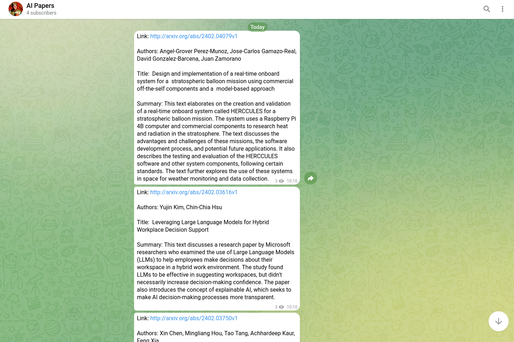

# AI Research Paper Scraper Telegram
The AI Research Paper Scraper Telegram is a Python script designed to fetch recent submissions from arXiv's Computer Science category, extract and summarize text from the linked PDFs, and then send these summaries to the specified Telegram channel. You can view the results in this Telegram channel: @[robotbulls_ai_papers](https://t.me/robotbulls_ai_papers).

This script get the 3 best papers daily and posts it on this Telegram channel. You can change this number in the script. 

Right now it gets the 3 most interesting papers for computer science but you can change the subject to math, physics etc.

## Installation

```pip install -r requirements.txt```

## Configuration
You will need to configure the following variables within config.json:

* api_key: Your OpenAI API key.
* token: Your Telegram bot token. You can get this by messaging the BotFather on Telegram.
* channel_id: Your Telegram channel ID. Make sure that the bot is an admin of your Telegram channel.

## Usage
Run the script from your terminal:

```python main.py```

This will execute the script, which performs the following steps:

1. Fetch Recent Papers: Fetches papers submitted to the arXiv Computer Science category the previous day.
2. Reduce Selection: Iteratively refines the selection of papers until a manageable number is obtained for summarization.
3. Extract and Summarize: Extracts text from each paper's PDF and generates a summary.
4. Send to Telegram: sends each summary to the specified Telegram channel.


